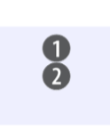

## Test project

``` javascript
var webpackOptions = webpackConfigMerger(require('ring-ui'), {
  entry: 'src/e.js' //// 2
})
```

```
var webpackOptions = webpackConfigMerger, {
  entry: 'src/entry.js', // plain
})
```

``` perl
var webpackOptions = webpackConfigMerger(require('perl'), {
  output: {
    path: 'path/to/dist'
  }
})
```

``` clike
int *i = 1200;
```

## Test code

``` perl
var webpackOptions = webpackConfigMerger(require('perl'), {
  output: {
    path: 'path/to/dist'
  }
})
```

0

1

2

3

4

5

6
